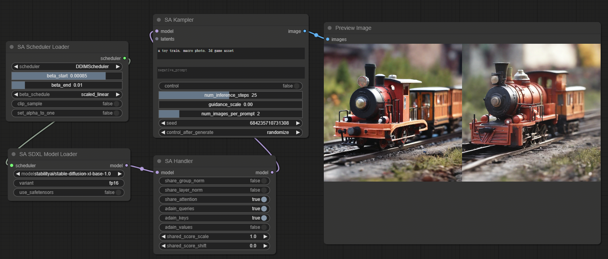

# ComfyUI nodes to use Style-Aligned

https://github.com/google/style-aligned/

## Install

- 推荐使用管理器 ComfyUI Manager 安装（On the Way）

- 手动安装：
    1. `cd custom_nodes`
    2. `git clone https://github.com/leeguandong/ComfyUI_Style_Aligned.git`
    3. 重启 ComfyUI

## Use

- 节点：
  - SA SDXL Model Loader: SDXL 模式模型加载,文生图
  - SA Scheduler Loader: scheduler加载
  - SA Controlnet ModelLoader: controlnet模型加载
  - SA Depth: depth图加载
  - SA Inversion: 图片反转
  - SA Handler: Style aligned 加载
  - SA SDXL Kampler: 文生图推理
  - SA SDXL Transfer Kampler: 图生图推理
  - SA SDXL Controlnet Kampler： controlnet推理

## Stars 

